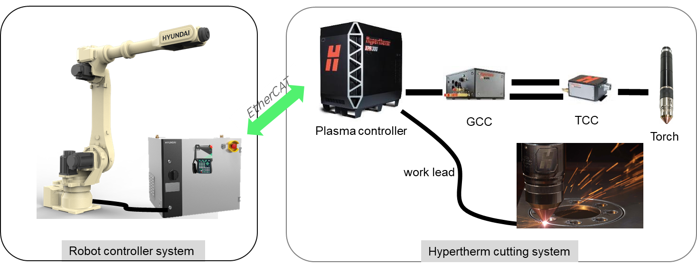

# 1.3 System Configuration

The Hypertherm plasma cutting system and robot controller are integrated as shown below to provide precise cutting quality and automation.

 

### (1) Hypertherm Plasma Power Supply  
The core of the system, this unit supplies high-voltage power to generate the plasma arc.
- Functions: Controls current and gas flow and monitors consumable life (for example, XPR 170).
- Communication: Connects to the robot controller through EtherCAT to exchange cutting parameters in real time.  

### (2) Robot System and Controller  
The drive system responsible for precise torch movement.
- Robot: A six-axis articulated robot with a payload of at least 10 kg is used to accommodate the torch and cable load and perform complex 3D or bevel cuts.
- Robot controller:
    - Sends cutting start/stop signals to the Hypertherm power supply and precisely controls torch position by calculating the travel speed and path.
    - Maintains a constant voltage-based gap between the torch and workpiece to compensate for workpiece warpage or deformation during cutting. Real-time Z-axis height compensation helps maintain a uniform kerf width.

### (3) Gas Console  
Precisely controls the pressure and mixture ratio of cutting and shielding gases such as oxygen, nitrogen, and air.
  - Function: Supplies gas optimized for the material and thickness, helping prevent oxidation and determine cut quality.
  - GCC (Gas Connect Console): Supplies and controls plasma and shield gases, including gas flow, pressure, and switching.

### (4) Torch and Lead Assembly  
Mounted at the end of the robot arm, this assembly performs the actual cutting.
  - Function: Receives coolant, gas, and power from the power supply and generates plasma.
  - TCC (Torch Connect Console): Transfers torch-related signals and power to generate and control the plasma arc.
  - Collision sensor: Immediately stops the robot if the torch contacts the workpiece or an obstacle, protecting the equipment.

### (5) Ground and Work Lead  
A cable connected to the workpiece to complete the circuit from the plasma power supply. Reliable grounding is essential for stable arc generation.
