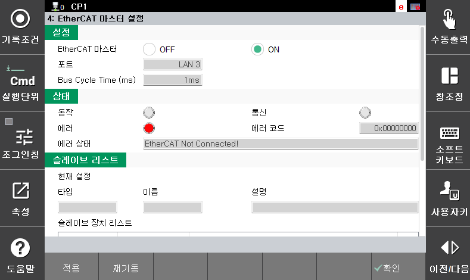
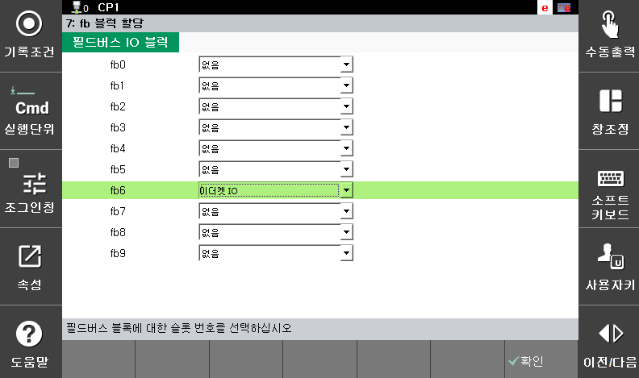

## 2.1.2 이더캣 설정

이더캣 마스터 설정은 기본적으로 산업용 통신 매뉴얼에서 설명하고 있습니다. 본 ㅣ

### (1) 하드웨어 연결 및 설정
- 연결 포트: 하이퍼썸 전원 장치 후면의 EtherCAT 전용 포트와 로봇 제어기의 LAN 포트 #3을 연결합니다.
- ESI 파일 (EtherCAT Slave Information): 하이퍼썸에서 제공하는 장치 설명 파일(XML 형식)을 로봇 제어기 설정 소프트웨어에 로드하여 통신 맵이 구성되어 있습니다. 산업용 통신 설정에서 해당 통신 장비를 선택하시면 됩니다.

### (2) 블럭 할당
- 필드 버스 IO 블럭 선택: 10개의 fb 블럭 가운데 원하는 번호에서 '이더캣 IO' 항목을 선택합니다. 해당 블럭 번호는 아크 신호 설정에 사용됩니다.

