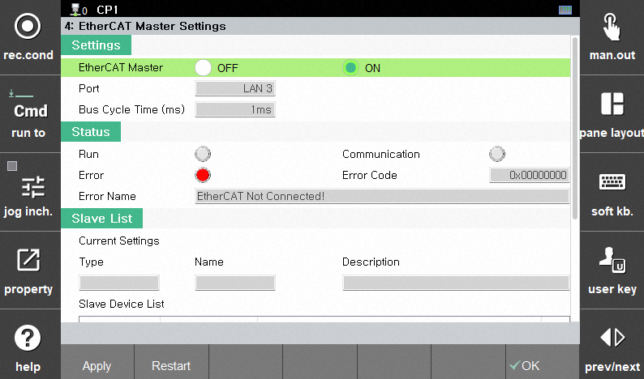
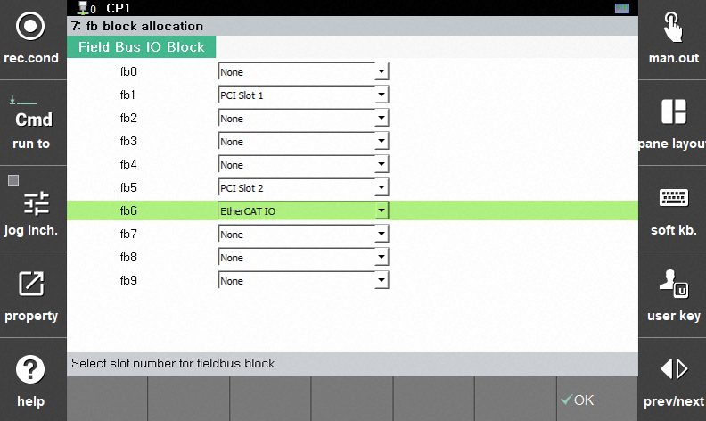

## 2.1.2 EtherCAT Settings

General EtherCAT master setup is described in the Industrial Communication Manual. The settings required for this application are described below.

### (1) Hardware Connection and Setup
- Connection port: Connect the dedicated EtherCAT port on the rear of the Hypertherm power supply to LAN port #3 on the robot controller.
- ESI file (EtherCAT Slave Information): The communication map is configured by loading the XML device-description file provided by Hypertherm into the robot controller setup software. Select the corresponding communication device in the industrial communication settings.

### (2) Block Assignment
- Fieldbus I/O block selection: Select `EtherCAT I/O` for one of the ten available fb blocks. The selected block number is used when configuring the arc signals.

