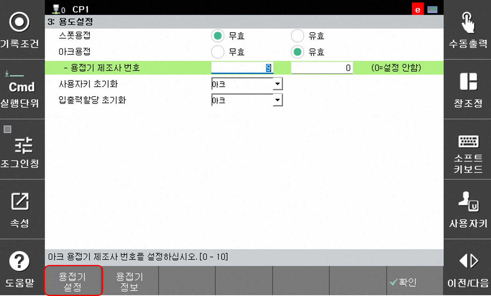
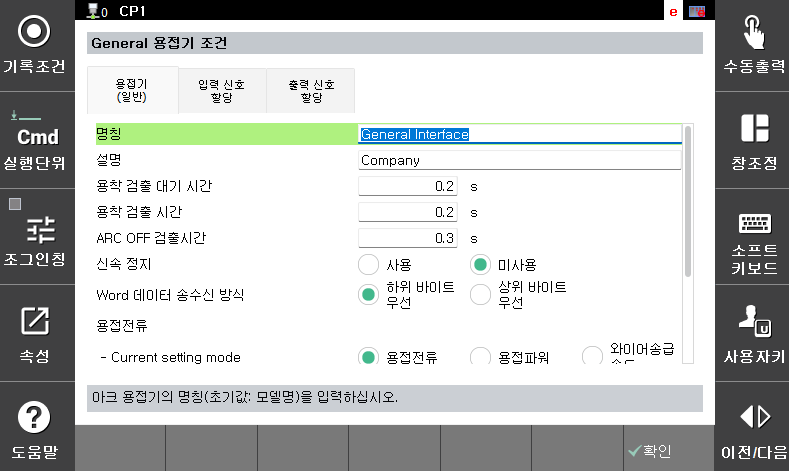

## 2.1.3 아크 용접기 설정

플라즈마 절단 응용에 해당 하는 아크 용접기 타입은 범용 용접기 입니다. 아래의 절차대로 용접기 설정을 수행합니다.

### (1) 용접기 선택
 
 `[F2:시스템, 5:초기화, 3:용도 설정]` 에서 아크용접을 유효로 선택하고 용접기 제조사 번호를 '9'로 입력합니다. (9:범용 용접기)

### (2) 신호 입력
`[용접기 설정]` 버튼을 누르면 범용 용접기의 신호 설정 페이지로 연결됩니다. FB 블럭 할당에서 선택한 블럭 번호를 기반으로 각 신호의 주소를 입력합니다.

