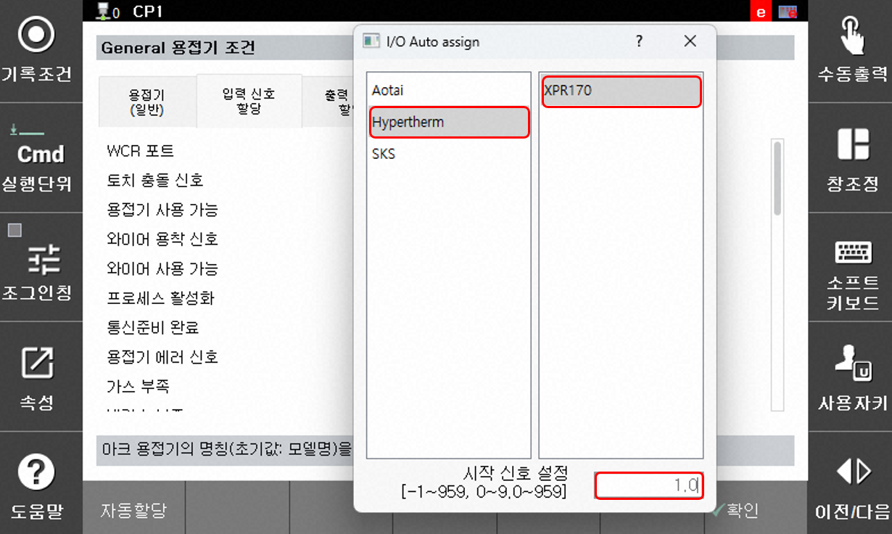
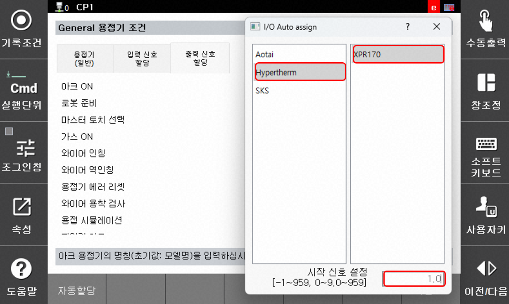

## 2.1.3 아크 용접기 설정

플라즈마 절단 응용에 해당 하는 아크 용접기 타입은 범용 용접기 입니다. 아래의 절차대로 용접기 설정을 수행합니다.

 

### (1) 용접기 선택
 
 `[F2:시스템, 5:초기화, 3:용도 설정]` 에서 아크용접을 유효로 선택하고 용접기 제조사 번호를 '9'로 입력합니다. (9:범용 용접기)  
 `[용접기 설정]` 버튼을 누르면 범용 용접기 설정 페이지로 연결됩니다.

 

### (2) 신호 입력
 일반 용접기 조건 페이지는 용접기, 입력 신호 할당, 출력 신호 할당 탭으로 구성되어 있습니다. 아크 용접기의 설정 화면을 공유하기 때문에 기존 아크 항목과 유사한 플라즈마 절단 신호가 설정되도록 하였습니다.

 - 입력 신호 할당  
 입력 신호 할당 탭에서 `[자동 설정]` 버튼을 누릅니다. 세부 항목 중에서 Hypertherm-XPR 모델을 순차적으로 선택하고, 기존에 할당했던 FB 블럭의 시작주소를 입력합니다.
   

 - 출력 신호 할당
 출력 신호 할당 탭에서 `[자동 설정]` 버튼을 누릅니다. 세부 항목 중에서 Hypertherm-XPR 모델을 순차적으로 선택하고, 기존에 할당했던 FB 블럭의 시작주소를 입력합니다.

 

### (3) 신호 할당 확인

기존 아크 범용 용접기의 항목과 유사한 항목에 할당 주소가 표시되며, 플라즈마 절단 모니터링 화면에서 상태를 확인할 수 있습니다.  
FB 블럭할당에서 fb1을 선택한 경우 아래 표와 같은 주소가 자동으로 할당됩니다.

 

|분류|아크용접|플라즈마 절단|신호 할당|
|:--:|:--:|:--:|:--:|
|입력|용접기 사용 가능|원격 전원 상태(remote power status)|fb1.9|
|입력|와이어 용착 신호|오믹 접촉(ohmic contact)|fb1.8|
|입력|프로세스 활성화|공정 준비 완료(process ready)|fb1.5|
|입력|통신준비 완료|시작 준비 완료(ready for start)|fb1.2|
|입력|용접기 에러 신호|에러|fb1.4|
|입력|로봇 모션(machine motion)|로봇 모션(machine motion)|fb1.0|
|입력|에러 우선순위 수준-error|에러 우선순위 수준-error|fb1.10|
|입력|에러 우선순위 수준-failure|에러 우선순위 수준-failure|fb1.11|
|입력|용접 전류|전류|fb1.16 ~ fb1.31|
|입력|용접 전압|전압|fb1.48 ~ fb1.63|
|입력|용접기 에러 번호|에러 번호|fb1.8 ~ fb1.23|
|**출력**|아크 ON|플라즈마 ON|fb1.0|
|**출력**|점화 유지(hold ignition)|점화 유지(hold ignition)|fb1.1|
|**출력**|천공(pierce)|천공(pierce)|fb1.2|