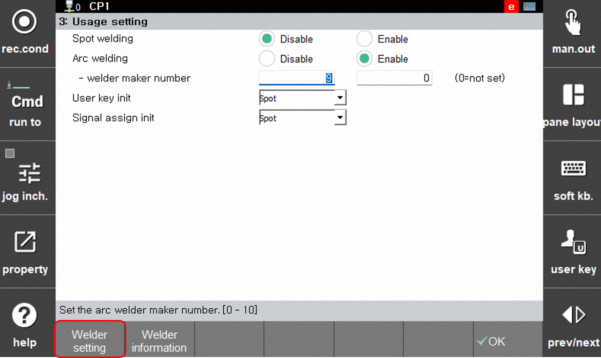
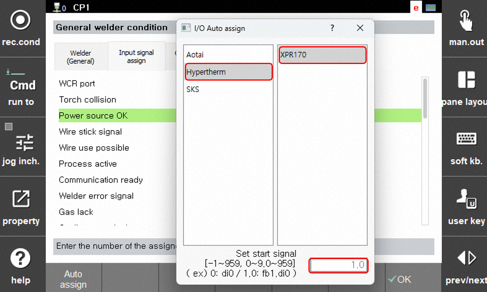
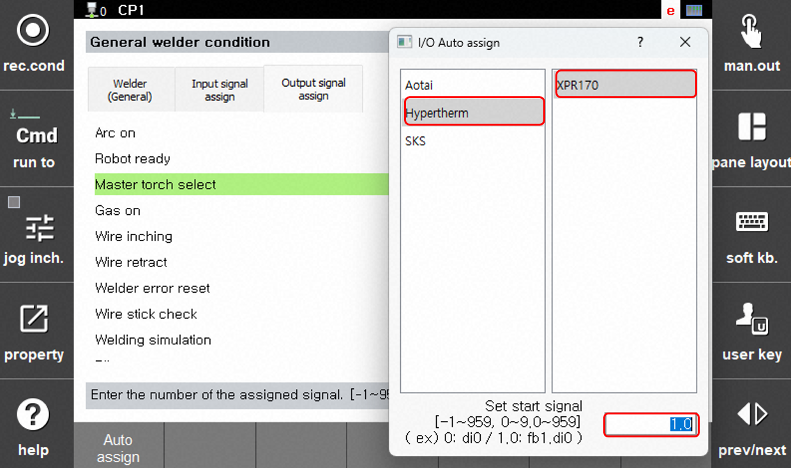

## 2.1.3 Arc Welder Settings

The arc welder type used by the plasma cutting application is General Welder. Configure the welder as described below.

 

### (1) Selecting the Welder

Under `[F2: System > 5: Initialization > 3: Application Settings]`, enable arc welding and enter welder manufacturer number `9` (9: General Welder).  
Press `[Welder Settings]` to open the General Welder settings page.

 

### (2) Signal Assignment
The General Welder condition page consists of the Welder, Input Signal Assignment, and Output Signal Assignment tabs. Because the arc welder settings screen is shared, plasma cutting signals are assigned to corresponding arc-welding items.

 - Input signal assignment  
 On the Input Signal Assignment tab, press `[Auto Setup]`. Select the Hypertherm-XPR model from the detailed options, and then enter the start address of the previously assigned FB block.

 - Output signal assignment  
 On the Output Signal Assignment tab, press `[Auto Setup]`. Select the Hypertherm-XPR model from the detailed options, and then enter the start address of the previously assigned FB block.

 

### (3) Verifying Signal Assignment

Assigned addresses are displayed for items corresponding to the existing General Arc Welder signals. Their states can be checked on the plasma cutting monitoring screen.  
If fb1 is selected during FB block assignment, the addresses are assigned automatically as shown below.

 

<table>
  <thead>
    <tr>
      <th style="text-align: center;">Type</th>
      <th style="text-align: center;">Arc Welding</th>
      <th style="text-align: center;">Plasma Cutting</th>
      <th style="text-align: center;">Signal Assignment</th>
    </tr>
  </thead>
  <tbody>
    <tr>
      <td align="center" rowspan="10">Input</td>
      <td align="center">Welder available</td>
      <td align="center">Remote power status</td>
      <td align="center">fb1.9</td>
    </tr>
    <tr>
      <td align="center">Wire stick signal</td>
      <td align="center">Ohmic contact</td>
      <td align="center">fb1.8</td>
    </tr>
    <tr>
      <td align="center">Process active</td>
      <td align="center">Process ready</td>
      <td align="center">fb1.5</td>
    </tr>
    <tr>
      <td align="center">Communication ready</td>
      <td align="center">Ready for start</td>
      <td align="center">fb1.2</td>
    </tr>
    <tr>
      <td align="center">Welder error signal</td>
      <td align="center">Error</td>
      <td align="center">fb1.4</td>
    </tr>
    <tr>
      <td align="center">Machine motion</td>
      <td align="center">Machine motion</td>
      <td align="center">fb1.0</td>
    </tr>
    <tr>
      <td align="center">Error priority level - error</td>
      <td align="center">Error priority level - error</td>
      <td align="center">fb1.10</td>
    </tr>
    <tr>
      <td align="center">Error priority level - failure</td>
      <td align="center">Error priority level - failure</td>
      <td align="center">fb1.11</td>
    </tr>
    <tr>
      <td align="center">Welding voltage</td>
      <td align="center">Voltage</td>
      <td align="center">fb1.16 ~ fb1.31</td>
    </tr>
    <tr>
      <td align="center">Welder error number</td>
      <td align="center">Error number</td>
      <td align="center">fb1.48 ~ fb1.63</td>
    </tr>
    <tr>
      <td align="center" rowspan="3"><strong>Output</strong></td>
      <td align="center">Arc ON</td>
      <td align="center">Plasma ON</td>
      <td align="center">fb1.0</td>
    </tr>
    <tr>
      <td align="center">Hold ignition</td>
      <td align="center">Hold ignition</td>
      <td align="center">fb1.1</td>
    </tr>
    <tr>
      <td align="center">Pierce</td>
      <td align="center">Pierce</td>
      <td align="center">fb1.2</td>
    </tr>
  </tbody>
</table>
