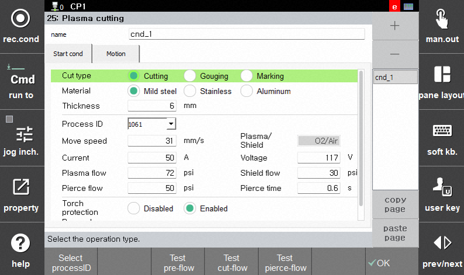
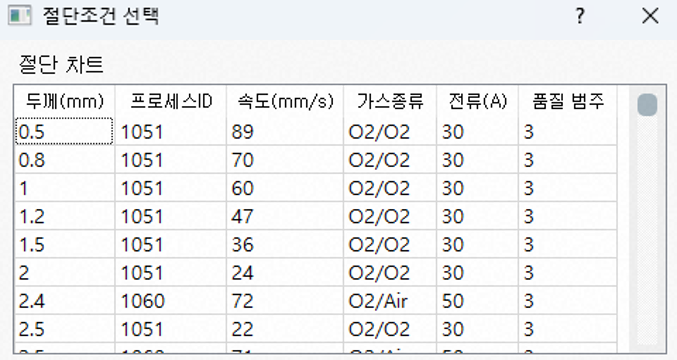

## 2.2.1 Start Conditions

These settings are sent to the plasma cutting system when the `plasma on` command is executed. Enter the workpiece thickness and select the process ID appropriate for the operation from the cut chart to display the default settings. The displayed values are the recommended settings for cutting quality, but they may be adjusted for special operating conditions or workpiece conditions.

(1) Process Type  
Cutting is the most commonly used process, but gouging and marking are also supported.

(2) Material  
Currently, only mild steel is supported.

(3) Thickness  
Enter the thickness of the workpiece.

(4) Process ID  
After entering the thickness, the applicable process IDs from the cut chart are listed. To view detailed cutting information, press `[F1: Select Process ID]` to open the cut chart. Select the desired process ID from the table sorted by thickness.

(5) Travel Speed  
The speed at which the robot follows the cutting path after piercing is complete. When the `plasma on` command is executed, the value entered here is stored in the `_plasma[cnd#].speed` system variable. Use this variable as the speed parameter in the job program.

(6) Plasma / Shield  
Selects the gases used for the plasma arc and shielding. When oxygen-air or air-air is selected for mild-steel cutting, this item cannot be edited.

(7) Current  
The current applied during cutting. The maximum current is limited by the Hypertherm plasma cutting system specifications (for example, XPR300: max. 300 A).

(8) Voltage  
The voltage applied during cutting. Height control maintains the distance between the torch and workpiece so that this voltage remains constant.

(9) Plasma Flow  
Sets the plasma gas pressure.

(10) Shield Flow  
Sets the shield gas pressure.

(11) Pierce Flow  
Sets the gas pressure used during piercing.

(12) Pierce Delay  
The time to wait at the piercing position until piercing is complete. Robot motion is enabled after this time elapses.

(13) Torch Protection  
Detects electrode failures caused by unstable cutting current to help prevent torch damage.

(14) Ramp-down Error Protection  
Detects the end of cutting and gradually reduces current and gas supply to protect the electrode and extend consumable life.
