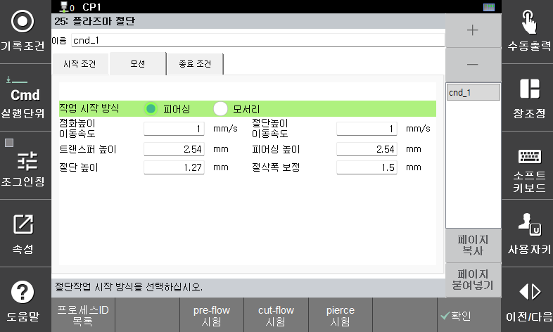

## 2.2.2 모션 조건

(1) 시작 타입  
부재면 내에서 천공(piercing)을 하면서 시작하는 타입과 에지에서 천공없이 절단을 시작하는 타입으로 구분합니다.

(2) 천공 속도  
천공 높이로 (pierce height) 이동할때 사용하는 속도입니다.

(3) 절단 속도  
절단 높이로 (cutting height) 이동할때 사용하는 속도입니다.

(4) 트랜스퍼 높이 (transfer height)  
아크 트랜스퍼를 위한 높이 설정입니다.

(5) 천공 높이 (pierce height)  
천공 시작을 위한 높이 설정입니다.

(6) 절단 높이 (transfer height)  
천공 이후 절단 이송을 시작하기 위한 높이 설정입니다.

(7) 절삭폭 보정 (kerf compensation)  
아크 형상의 폭 길이 만큼 부재가 절삭되는 것을 고려하여 절삭 경로를 수정하기 위한 경로 보정값입니다.

