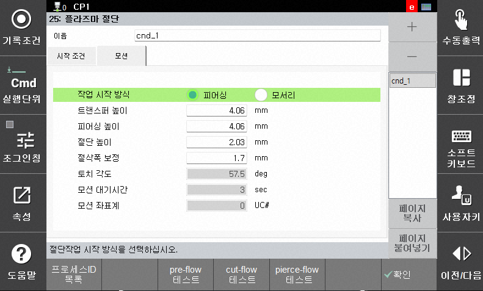

## 2.2.2 Motion Conditions

(1) Start Type  
Select either piercing start, which starts by piercing inside the workpiece, or edge start, which begins cutting at an edge without piercing.

(2) Piercing Speed  
The speed used to move to the piercing height.

(3) Cutting Speed  
The speed used to move to the cutting height.

(4) Transfer Height  
Sets the height used for arc transfer.

(5) Pierce Height  
Sets the height at which piercing starts.

(6) Cutting Height  
Sets the height at which cutting travel begins after piercing.

(7) Kerf Compensation  
A path compensation value that accounts for the width of material removed by the plasma arc. Use one-half of the kerf width shown in the cut chart directly as the path correction value.

(8) Torch Angle  
Sets the torch tilt angle relative to the workpiece during gouging. This value is available to job programs through the `_plasma[cnd#].torch_angle` system variable.

(9) Motion Delay  
Sets the time to wait while maintaining the arc at the end of gouging. This value is available to job programs through the `_plasma[cnd#].motion_delay` system variable.

(10) Motion Coordinate System  
Sets the user coordinate system used as the reference when moving to the cutting height during gouging. To account for the torch angle, the torch moves to the cutting height along the selected user-coordinate direction rather than the tool direction.
