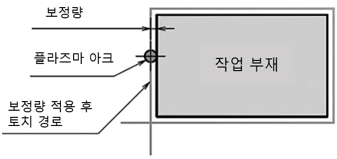

# 3.2 로봇 모션

양호한 절단 품질을 위해서 로봇 모션은 두 가지 기능이 요구됩니다. 부재와 토치사이의 거리를 제어하기 위한 툴 Z방향의 모션 제어와 티칭된 경로를 이동하면서 부재를 절단할때 절삭폭을 고려한 툴 Y방향 쉬프트 모션입니다.

## 3.2.1 높이 제어

플라즈마 절단 시 토치와 모재 사이의 거리는 절단 품질과 소모품 수명에 직결됩니다. 본 시스템은 '아크 전압과 거리의 상관관계'를 이용하여 절단 중 토치 높이를 실시간으로 보정합니다.

(1) 제어 원리 (Principle of Operation)  
 - 전압과 거리의 관계: 플라즈마 아크의 전압은 토치와 모재 사이의 거리가 멀어지면 높아지고, 가까워지면 낮아지는 특성을 가집니다.
 - 피드백 루프: 로봇 제어기는 하이퍼썸 전원 장치로부터 실시간 아크 전압(Actual Voltage) 데이터를 EtherCAT 통신으로 주기적으로 수신합니다.
 - 보정 동작: 수신된 실제 전압을 사용자가 설정한 목표 전압(Set Voltage)과 비교하여, 그 차이만큼 로봇의 Z축(높이)을 실시간으로 상하 이동시킵니다.  본 기능은 기존 아크 용접에서 사용하는 `heightsen` 명령어를 사용합니다.

(2) 주요 제어 단계  
 - IHS (초기 높이 감지): 절단 시작 전, 토치를 하강시켜 모재의 위치를 파악하고 정확한 피어싱/절단 시작 높이를 설정합니다.  
 - 전압 샘플링 (Voltage Sampling): 절단이 시작되고 아크가 안정화되면, 시스템은 현재의 전압을 측정합니다. 
 - 추종 및 보정: 모재가 휘어 있거나 경사가 있더라도, 측정되는 전압을 일정하게 유지하도록 토치 높이를 조절하여 일정한 절삭 폭(Kerf)을 유지합니다.  

(3) 주요 설정 파라미터  
 - 목표 전압 (Set Voltage): 희망하는 절단 높이에 해당하는 전압 값입니다. 하이퍼썸 절단 도표(Cut Chart)에 명시된 값을 기준으로 설정합니다.
 - THC 감도 (Gain/Sensitivity): 전압 차이에 반응하는 속도입니다. 너무 높으면 토치가 위아래로 진동(Hunting)할 수 있고, 너무 낮으면 모재의 굴곡을 따라가지 못합니다.
 - THC 지연 시간 (THC Delay): 피어싱 후 아크가 완전히 안정될 때까지 높이 제어를 잠시 유보하는 시간입니다.

## 3.2.2 절삭 폭 보정 기능

플라즈마 아크는 일정한 두께(절단폭)를 가지며 소재를 녹여내기 때문에, 설계 도면의 치수와 동일한 결과물을 얻기 위해서는 토치의 중심 경로를 절단면 바깥쪽으로 이동시키는 보정(Compensation) 모션이 필수적입니다. 

(1) 절단면 품질 차이
 -  원인 : 플라즈마 가스는 토치 내부에서 스월 링 (swirl ring)에 의해 회전하면서 분사됩니다. 이로 인해 아크가 한쪽 방향으로 비대칭적으로 치우치게 되고 더 강하게 배출됩니다. 에너지 분포의 차이는 절단면 좌우의 품질 차이로 이어집니다.
 - 품질 차이
   - 양호한 면 : 직각도가 우수하고 절단면이 매끄러우며 슬래그 부착이 적습니다.
   - 불량한 면 : 경사(bevel)가 발생하고 절단면이 거칠며 슬래그 부착이 증가합니다.

  
    양호한 절단면은 대체로 진행 방향의 오른쪽입니다. 티칭 및 로봇 모션시 오른쪽 면이 사용면이 되도록 모션방향을 정해야합니다. 또한 절삭 폭 보정시에도 양호한 면 방향으로 쉬프트해야 합니다.


(1) 절단폭(Kerf)과 쉬프트의 원리  
 - 절단폭(Kerf Width): 플라즈마 아크에 의해 실제 제거되는 금속의 폭입니다. 이는 노즐 사이즈, 전류량, 절단 속도 및 소재 두께에 따라 달라집니다.
 - 쉬프트 거리(Offset Distance): 절단폭의 절반(1/2 Kerf)만큼 토치를 진행 방향의 좌측 또는 우측으로 이동시킵니다. (예: 절단폭이 2.0mm인 경우, 토치 중심을 티칭 라인에서 1.0mm 바깥으로 쉬프트합니다.)

(2) 툴 좌표계 기반 X방향 쉬프트 (TCP Shift)  
 - 로봇 제어기에서 토치의 진행 방향을 기준으로 보정 값을 적용합니다.
 - 좌우 보정(Left/Right Offset): 로봇의 툴 좌표계(Tool Coordinates) 상에서 진행 방향에(+X) 수직인 축(+- Y)을 제어하여 경로를 쉬프트 시킵니다.
 - 보정 방향 결정
   - 좌보정(-Y): 토치 진행 방향의 왼쪽으로 쉬프트 (일반적인 시계 반대방향 외부 절단 시(내부 사용))
   - 우보정(+Y): 토치 진행 방향의 오른쪽으로 쉬프트 (내부 구멍 절단 시(외부 사용))  

(3) 하이퍼썸 절단 도표(Cut Chart) 활용  
 - 절삭 폭 정보 : 하이퍼썸 매뉴얼의 'Cut Chart'에는 각 조건별 [Kerf Width] 예상값이 명시되어 있습니다.
로봇 제어기의 레지스터(Register)에 이 값을 입력하면, 프로그램 내에서 계산식을 통해 자동으로 쉬프트 거리가 산출되도록 구성합니다.
 - 보정값 = 절단 도표 절삭 폭 / 2 + 여유치(Margin = 0)  

(4) 주요 설정 및 주의 사항  
 - 리드인(Lead-in) 구간의 중요성: 쉬프트 모션은 절단 시작점 이전인 리드인 구간에서 점진적으로 적용되어야 합니다. 실제 제품 라인에 진입했을 때는 이미 보정 거리가 확보된 상태여야 단면에 턱이 생기지 않습니다.
 - 속도 변화에 따른 보정: 절단 속도가 느려지면 절단폭이 넓어지므로, 코너 구간 등에서 속도가 감속될 경우 쉬프트 거리를 미세하게 조정하거나 속도를 일정하게 유지하는 것이 중요합니다.
 - 소모품 마모 고려: 노즐이 마모될수록 아크가 굵어져 절단폭이 넓어집니다. 정기적으로 테스트 피스를 절단하여 치수를 측정한 후 쉬프트 값을 보정하십시오. 