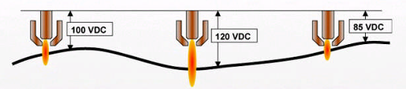

## 2.3.1 높이 제어

플라즈마 절단 시 토치와 모재 사이의 거리는 절단 품질과 소모품 수명에 직결됩니다. 본 시스템은 '아크 전압과 거리의 상관관계'를 이용하여 절단 중 토치 높이를 실시간으로 보정합니다.

(1) 제어 원리 (Principle of Operation)  

 - 전압과 거리의 관계: 플라즈마 아크의 전압은 토치와 모재 사이의 거리가 멀어지면 높아지고, 가까워지면 낮아지는 특성을 가집니다.
 - 피드백 루프: 로봇 제어기는 하이퍼썸 전원 장치로부터 실시간 아크 전압(Actual Voltage) 데이터를 EtherCAT 통신으로 주기적으로 수신합니다.
 - 보정 동작: 수신된 실제 전압을 사용자가 설정한 목표 전압(Set Voltage)과 비교하여, 그 차이만큼 로봇의 Z축(높이)을 실시간으로 상하 이동시킵니다.  본 기능은 기존 아크 용접에서 사용하는 `heightsen` 명령어를 사용합니다.

(2) 주요 제어 단계  
 - IHS (초기 높이 감지): 절단 시작 전, 토치를 하강시켜 모재의 위치를 파악하고 정확한 피어싱/절단 시작 높이를 설정합니다.  
 - 전압 샘플링 (Voltage Sampling): 절단이 시작되고 아크가 안정화되면, 시스템은 현재의 전압을 측정합니다. 
 - 추종 및 보정: 모재가 휘어 있거나 경사가 있더라도, 측정되는 전압을 일정하게 유지하도록 토치 높이를 조절하여 일정한 절삭 폭(Kerf)을 유지합니다.  

(3) 주요 설정 파라미터  
 - 목표 전압 (Set Voltage): 희망하는 절단 높이에 해당하는 전압 값입니다. 하이퍼썸 공정 도표(Cut Chart)에 명시된 값을 기준으로 설정합니다.
 - THC 감도 (Gain/Sensitivity): 전압 차이에 반응하는 속도입니다. 너무 높으면 토치가 위아래로 진동(Hunting)할 수 있고, 너무 낮으면 모재의 굴곡을 따라가지 못합니다.
 - THC 지연 시간 (THC Delay): 피어싱 후 아크가 완전히 안정될 때까지 높이 제어를 잠시 유보하는 시간입니다.
