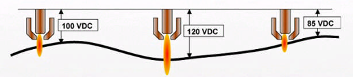

## 2.3.1 Height Control

During plasma cutting, the distance between the torch and workpiece directly affects cutting quality and consumable life. This system corrects the torch height in real time during cutting by using the relationship between arc voltage and distance.

(1) Principle of Operation  

 - Voltage-distance relationship: Plasma arc voltage increases as the distance between the torch and workpiece increases, and decreases as the distance becomes smaller.
 - Feedback loop: The robot controller periodically receives actual arc-voltage data from the Hypertherm power supply over EtherCAT.
 - Correction: The controller compares the measured voltage with the target voltage set by the user and moves the robot up or down along the Z axis in real time according to the difference. This function uses the `heightsen` command provided by the arc-welding application.

(2) Main Control Stages  
 - IHS (Initial Height Sensing): Before cutting starts, the torch is lowered to locate the workpiece surface and establish the correct piercing/cutting start height.  
 - Voltage Sampling: Once cutting has started and the arc has stabilized, the system measures the current voltage.  
 - Tracking and correction: Even if the workpiece is warped or inclined, the torch height is adjusted to maintain a constant measured voltage and uniform kerf width.  

(3) Main Setting Parameters  
 - Set Voltage: The voltage corresponding to the desired cutting height. Set this value based on the Hypertherm cut chart.
 - THC Gain/Sensitivity: The response rate to a voltage difference. If it is too high, the torch may hunt up and down; if it is too low, the torch may not follow workpiece contours.
 - THC Delay: The period after piercing during which height control is suspended until the arc is fully stabilized.
