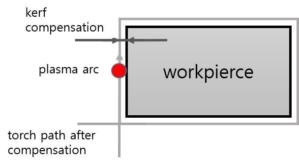

## 2.3.2 Kerf Compensation

Because the plasma arc has a finite width and removes material as it cuts, compensation motion that offsets the torch center path away from the finished surface is required to produce dimensions that match the design drawing.

(1) Difference in Cut-surface Quality
 - Cause: Plasma gas is rotated by the swirl ring inside the torch as it is discharged. This makes the arc asymmetric and stronger on one side. The resulting difference in energy distribution produces different cut quality on the two sides.
 - Quality difference
   - Good side: High squareness, smooth cut surface, and minimal slag adhesion.
   - Poor side: Beveling, a rough cut surface, and increased slag adhesion.


The good cut surface is generally on the right side of the direction of travel. Set the teaching and robot motion direction so that the right-hand surface is the finished surface. Kerf compensation must also shift the torch toward the good side.


(2) Kerf and Shift Principle  
 - Kerf width: The width of metal actually removed by the plasma arc. It varies according to nozzle size, current, cutting speed, and material thickness.
 - Offset distance: Shift the torch left or right by half of the kerf width. For example, if the kerf width is 2.0 mm, shift the torch center 1.0 mm outward from the taught line.

(3) Tool-coordinate Y-direction Shift (TCP Shift)  
 - The robot controller applies the compensation value relative to the torch travel direction.
 - Left/right offset: The path is shifted by controlling the axis (±Y) perpendicular to the travel direction (+X) in the robot tool coordinate system.
 - Determining the compensation direction
   - Left compensation (-Y): Shifts the torch to the left of the travel direction. This is generally used for counterclockwise outside cutting when the inside surface is used.
   - Right compensation (+Y): Shifts the torch to the right of the travel direction. This is used for inside-hole cutting when the outside surface is used.  

(4) Using the Hypertherm Cut Chart  
 - Kerf information: The Hypertherm manual's cut chart provides an estimated kerf width for each condition. Enter this value in a robot controller register so that the shift distance can be calculated automatically in the program.
 - Compensation value = cut-chart kerf width / 2 + margin (margin = 0)  

(5) Main Settings and Precautions  
 - Importance of the lead-in: Shift motion must be applied gradually along the lead-in before the cutting start point. The full compensation distance must already be established when the torch enters the product profile to prevent a step on the cut surface.
 - Compensation for speed changes: Kerf width increases as cutting speed decreases. If the robot decelerates at a corner or similar section, fine-tune the shift distance or maintain a constant speed.
 - Consumable wear: As the nozzle wears, the arc becomes wider and the kerf increases. Periodically cut and measure a test piece, and then adjust the shift value.
