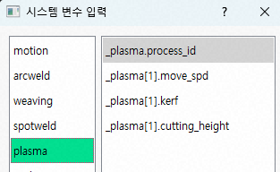

## 2.4.1 시스템 변수
    



<br>

  - _plasma[cnd#].process_id
    - 용도 : 플라즈마 절단기로 프로세스 ID를 전송, ID는 조건 설정 페이지에서 두께에 맞게 선택
    - 작동 : 입력된 ID 값이 이더캣 통신으로 전달되고, 설정 완료시 'ready for start' 상태가 ON 됨
    - 사용법 : 대입문의 좌변에 해당 시스템 변수를 선택하고 우변에 프로세스 ID를 입력함
    - 사용 예제
       ```python
       _plasma.process_id = 1000
       ```


  - _plasma[cnd#].speed
    - 용도 : 프로세스 ID 마다 설정된 절단 속도를 사용자가 쉽게 입력하도록 함
    - 작동 : 절단 조건 번호에 설정된 절단 속도를 해당 시스템 변수로 가져옴
    - 사용법 : `move`문의 속도 변수에 해당 시스템 변수를 사용함 (mm/sec)
    - 사용 예제
        ```python
        plasma on,cnd=1
        move P,spd=_plasma[1].move_spd,accu=0,tool=0
        ```


  - _plasma[cnd#].kerf
    - 용도 : 절삭폭을 고려한 로봇의 쉬프트 모션 명령을 사용자가 쉽게 편집하도록 함
    - 작동 : 절단 조건 번호에 설정된 절삭폭 보정량을 해당 시스템 변수로 가져옴
    - 사용법 : `move`문의 목표 위치 작성시 해당 시스템 변수를 사용함 (mm)
    - 사용 예제
        ```python
        plasma on,cnd=1
        var sft
        sft=Shift(0,_plasma[1].kerf,0,0,0,0,"tool")
        move P,tg=po1+sft,spd=_plasma[1].speed,accu=0,tool=0
        ```

  - _plasma[cnd#].cutting_height
    - 용도 : 티칭 작업시 절단 위치를 사용자가 쉽게 입력하도록 함
    - 작동 : 절단 조건 번호에 설정된 절단 위치를 해당 시스템 변수로 가져옴
    - 사용법 : `move`문의 목표 위치에 해당 시스템 변수를 사용함 (mm)
    - 사용 예제
        ```python
        var cut_hgt=_plasma[1].cutting_height
        var sft_height=Shift(0,0,-cut_hgt,0,0,0,"tool")
        move P,tg=po_cut_srt+sft_height,spd=cut_spd*0.5mm/sec,accu=0,tool=0
        ```
