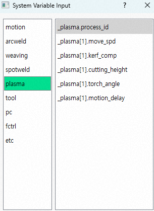

## 2.4.1 System Variables



<br>

  - `_plasma.process_id`
    - Purpose: Sends a process ID to the plasma cutting system. Select an ID appropriate for the material thickness on the condition settings page.
    - Operation: The entered ID is sent over EtherCAT. When setup is complete, the Ready for Start state turns ON.
    - Usage: Select this system variable on the left side of an assignment statement and enter the process ID on the right side.
    - Example
       ```python
       _plasma.process_id = 1000
       ```

  - `_plasma[cnd#].speed`
    - Purpose: Lets the user easily apply the cutting speed configured for each process ID.
    - Operation: Retrieves the cutting speed configured for the specified cutting condition number.
    - Usage: Use this system variable as the speed parameter of a `move` statement (mm/sec).
    - Example
        ```python
        plasma on,cnd=1
        move P,spd=_plasma[1].speed,accu=0,tool=0
        ```

  - `_plasma[cnd#].kerf`
    - Purpose: Makes it easy to program robot shift motion that compensates for the kerf width.
    - Operation: Retrieves the kerf compensation value configured for the specified cutting condition number.
    - Usage: Use this system variable when defining the target position of a `move` statement (mm).
    - Example
        ```python
        plasma on,cnd=1
        var sft
        sft=Shift(0,_plasma[1].kerf,0,0,0,0,"tool")
        move P,tg=po1+sft,spd=_plasma[1].speed,accu=0,tool=0
        ```

  - `_plasma[cnd#].cutting_height`
    - Purpose: Makes it easy to enter the cutting position during teaching.
    - Operation: Retrieves the cutting height configured for the specified cutting condition number.
    - Usage: Use this system variable when defining the target position of a `move` statement (mm).
    - Example
        ```python
        var cut_hgt=_plasma[1].cutting_height
        var sft_height=Shift(0,0,-cut_hgt,0,0,0,"tool")
        move P,tg=po_cut_srt+sft_height,spd=cut_spd*0.5mm/sec,accu=0,tool=0
        ```

  - `_plasma[cnd#].torch_angle`
    - Purpose: Makes it easy to enter the torch angle required for gouging in a job program.
    - Operation: Retrieves the gouging torch angle configured for the specified cutting condition number.
    - Usage: Use this system variable when setting the torch orientation for gouging (deg).
    - Example
        ```python
        var gouging_angle=_plasma[1].torch_angle
        ```

  - `_plasma[cnd#].motion_delay`
    - Purpose: Makes it easy to enter the required wait time at the end of gouging in a job program.
    - Operation: Retrieves the gouging end delay configured for the specified cutting condition number.
    - Usage: Use this system variable as the wait time of the `plasma off` command at the end of gouging (sec).
    - Example
        ```python
        plasma off,wait=_plasma[1].motion_delay
        ```
