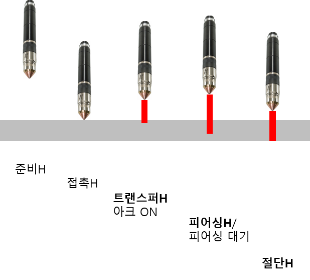
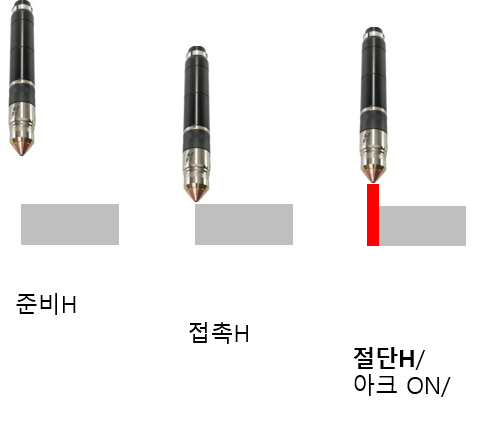

## 2.4.2 plasma on/off 명령어

   - 지정된 높이로 이동하고 플라즈마 아크를 시작하거나 종료함
   - 문법
       
        ```python  
        plasma on/off,cnd=<조건번호>,wait=<대기시간>
        ```
    
   - 파라미터
    
        |항목 |입력 |기능 |
        |:--:|:--:|:--:|
        |플라즈마 시작|on|설정 높이로 이동 및 아크 시작|
        |플라즈마 종료|off| 설정 대기 시간 후 아크 종료|
        |조건 번호|1~1024|절단 조건 지정|
        |대기시간|0~30초|절단 제어기 준비 대기|

   - 사용 예제

        ```python  
        plasma on,cnd=1
        move P,spd=_plasma.speed,accu=0,tool=0
        plasma off,cnd=1
        ```
    

   <Br>

   ### 상세 기능 절차
   ---
   `plasma on` 명령어 수행 시 내부적으로 진행되는 절차들을 설명합니다. 해당 명령어는 플라즈마 아크를 on 시키는 기능 뿐만 아니라, 토치를 조건에 설정된 높이로 이동시키며 천공(piercing)까지 수행한 후 절단 이송을 대기하는 상태까지 수행합니다.

   (1) 프로세스 ID 확인  
   'cnd=#' 에 입력된 조건 번호와 절단기에 설정된 조건번호를 확인합니다. 만약 다르다면, 프로세스 ID 전송을 먼저 수행해야합니다.

   (2) 로봇 이동과 아크 ON  
   `plasma on` 명령어의 시작은 항상 부재와 접촉 위치입니다. 이후 명령어를 실행하면 로봇의 이동은 절단 시작 방식에 따라서 각기 달라집니다. 절단 차트(cut chart)는 프로세스 ID 별로 모든 높이와 대기 시간 정보를 정의하고 있습니다.
   

   - 천공(piercing) 방식  
   부재의 내부 면에서 절단을 시작하므로 천공(piercing) 작업이 먼저 선행되어야 합니다. 플라즈마 아크를 안정화 하기 위한 추가적인 높이 이동 후에 절단을 시작 할 수 있습니다.

     

     - 점화 높이(ignition height) 이동 : 전이 높이(transfer height)가 점화 높이에 해당함
     - 아크 ON : 플라즈마 아크를 발생시킴
     - 천공 높이(piercing height) 이동 : 아크가 안정화 되고 본격적인 천공을 시작함
     - 천공 대기(piercing delay) : 천공 완료까지 대기함
     - 모션 신호 확인 : 로봇 이동 신호(machine motion) 신호를 확인함
     - 절단 높이(cutting height) 이동 : 절단 가능 높이로 이동하여 절단을 시작함


   - 에지(edge) 방식  
     부재의 에지(edge, 모서리)에서 절단을 시작하므로, 천공 과정이 불필요합니다. 절단 높이로 바로 이동하여 점화를 시작하고 플라즈마 아크가 안전화 되고 나면 절단 모션을 수행 할 수 있습니다.  
     
     

     - 점화 높이(ignition height) 이동 : 절단 높이가 점화 높이에 해당함
     - 아크 ON : 플라즈마 아크를 발생시킴
     - 대기 : 아크가 안정화 되도록 대기함
   
   
   
   


