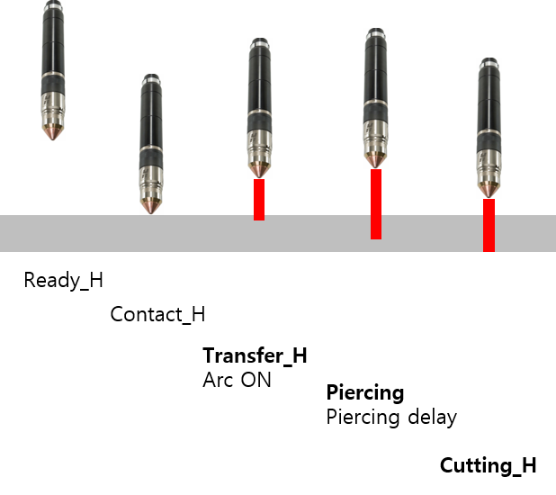
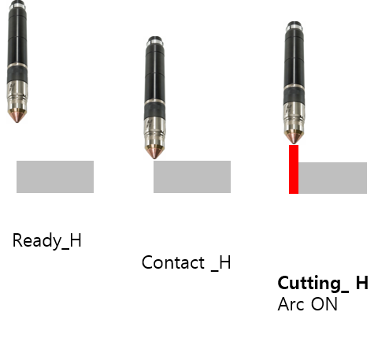

## 2.4.2 plasma on/off Command

   - Moves the torch to the specified height and starts or stops the plasma arc.
   - Syntax

        ```python
        plasma on/off,cnd=<condition number>,wait=<wait time>
        ```

   - Parameters

        |Item|Input|Function|
        |:--:|:--:|:--:|
        |Plasma start|on|Moves to the configured height and starts the arc|
        |Plasma stop|off|Stops the arc after the specified delay|
        |Condition number|1-1024|Specifies the cutting condition|
        |Wait time|0-30 sec|Specifies the cutting controller wait time|

   - Example

        ```python
        plasma on,cnd=1
        move P,spd=_plasma[1].speed,accu=0,tool=0
        plasma off,cnd=1
        ```

   <br>

   ### Detailed Sequence
   ---
   The following describes the internal sequence performed by the `plasma on` command. In addition to turning on the plasma arc, the command moves the torch to the heights specified by the condition, performs piercing, and then waits in a state ready for cutting travel.

   (1) Checking the Process ID  
   The system compares the condition number entered as `cnd=#` with the condition set in the plasma cutting system. If they differ, send the process ID first.

   (2) Robot Motion and Arc ON  
   The `plasma on` command must always start with the torch at the workpiece contact position. After the command is executed, robot motion differs according to the cutting start method. The cut chart defines all heights and wait times for each process ID.

   - Piercing start  
   Because cutting starts inside the workpiece, piercing must be performed first. Cutting can begin after additional height movements that stabilize the plasma arc.

     

     - Move to ignition height: The transfer height is used as the ignition height.
     - Arc ON: Generates the plasma arc.
     - Move to pierce height: Starts full piercing after the arc stabilizes.
     - Pierce delay: Waits until piercing is complete.
     - Check motion signal: Checks the Machine Motion signal.
     - Move to cutting height: Moves to the cutting height and starts cutting.

   - Edge start  
     Because cutting starts at the edge or corner of the workpiece, no piercing process is required. The torch moves directly to the cutting height and starts ignition. Cutting motion can begin after the plasma arc has stabilized.

     

     - Move to ignition height: The cutting height is used as the ignition height.
     - Arc ON: Generates the plasma arc.
     - Wait: Waits for the arc to stabilize.
