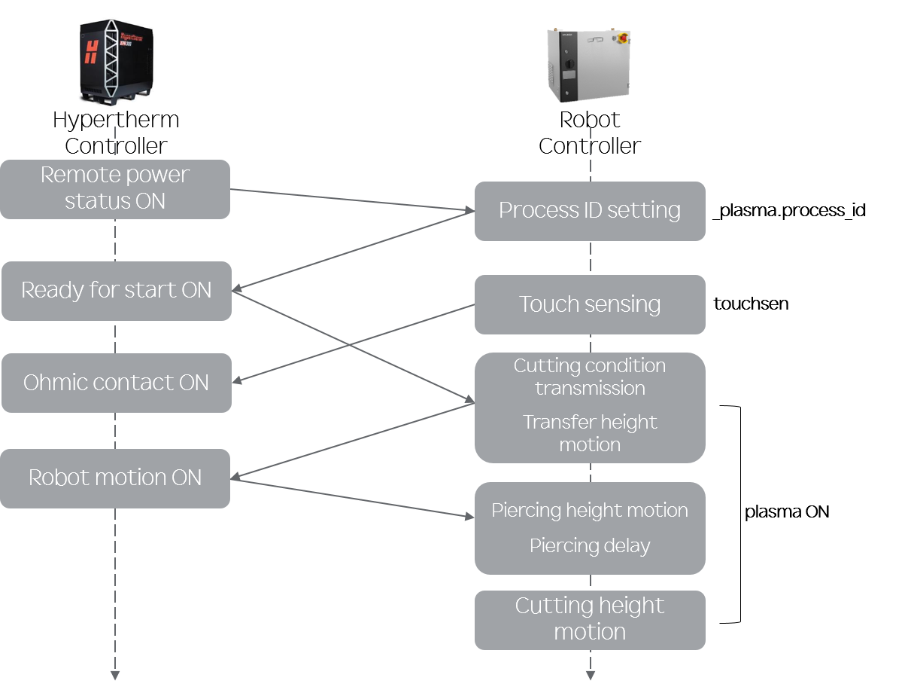

# 3.1 Setup Sequence

The cutting operation is prepared in the following order: establish communication, select the General Arc Welder, edit conditions, and create the program. After the initial settings are complete, subsequent operations require only condition editing and program creation.

Special care must be taken when selecting the process ID. The plasma cutting system and robot controller share a cut chart that contains cutting conditions for different materials, thicknesses, and quality requirements. Select the appropriate process ID for the work environment. Because this cutting function is limited to mild steel, cutting conditions are classified by workpiece thickness. Select one of the process IDs listed for the workpiece thickness. After an ID is selected, operating conditions such as current, voltage, and speed are displayed automatically. Some values in the cut chart can be edited by the user and are sent to the plasma cutting system when the `plasma on` command is executed. If the same process ID is already set, sending `_plasma.process_id` may be omitted. However, if the ID set in the plasma cutting system differs from the ID of the condition specified by `plasma on`, a process ID mismatch error occurs.

 

|Step|Description|Remarks|
|:--:|:--:|:--:|
|1|Configure EtherCAT communication|Refer to the Industrial Communication settings|
|2|Select the arc welder (for touch-sensing setup)|Refer to Arc Welder Settings|
|3|Set Accuracy|Level 0: tool-end position 0 mm / orientation 0 deg (consider the workpiece-to-torch distance of several millimeters or less)|
|4|Configure plasma cutting application conditions|Enter the workpiece thickness|
|5|Select the process ID for the thickness|Default conditions are set when an ID is selected All but certain items can be edited|
|6|Teach and create the job program - `_plasma.process_id` - `touchsen` - `plasma on` - `heightsen` - `move` - `plasma off`|Refer to Section 2.4, Robot Programming|
|7|Turn the Work button ON|Keep it ON during operation|
|8|Start automatic operation|Perform cutting|
|9|Monitor status|Important data is updated in real time|
|10|Complete the operation|Check cutting quality|

 

