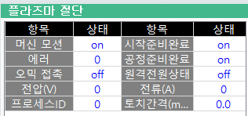

# 4.2 모니터링

본 시스템은 절단 공정의 안정성과 장비의 상태를 확인하기 위해 전원 장치의 내부 데이터를 실시간으로 로봇 제어기에 전달합니다. 작업자는 이를 통해 장비의 이상 유무를 즉각 파악하고 절단 상황을 점검할 수 있습니다.

아래 버튼 경로를 통해 플라즈마 절단 기능의 패널(panel) 모니터링을 선택합니다.  
`[창조정] - [F1: 선택] - 플라즈마 절단`

 

 

|항목|의미|상태|
|:--:|:--:|:--:|
|머신 모션   (machine motion)|천공 완료 후 절단 모드 가능 상태|on/off|
|시작준비완료   (ready for start)|ID 입력 완료 상태|on/off|
|에러   (error / code)|에러 상태 및 에러 코드|'-'(에러없음) /   에러 코드|
|공정준비완료   (process ready)|ID 설정 유무|on/off|
|오믹 접촉   (ohmic contact)|토치의 부재 접촉 상태|on/off|
|원격전원상태   (remote power status)|절단기의 전원 상태|on/off|
|전압 (voltage)|전압값(V)|~ V|
|전류 (current)|전류값(A)|~ A|
|프로세스ID (process ID)|절단기의 설정 프로세스 ID|#|
|토치간격 (stand-off)|토치-부재간 거리| mm |

