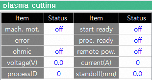

# 4.2 Monitoring

To verify cutting-process stability and equipment status, the system sends internal power-supply data to the robot controller in real time. This lets the operator immediately identify abnormal equipment conditions and monitor the cutting operation.

Use the following menu path to select the plasma cutting monitoring panel:  
`[Window Control] - [F1: Select] - Plasma Cutting`

 

 

|Item|Description|State|
|:--:|:--:|:--:|
|Machine Motion|Cutting motion is permitted after piercing is complete|on/off|
|Ready for Start|Process ID setup is complete|on/off|
|Error / Code|Error state and error code|`-` (no error) / error code|
|Process Ready|Indicates whether a process ID is set|on/off|
|Ohmic Contact|Torch contact with the workpiece|on/off|
|Remote Power Status|Power state of the plasma cutting system|on/off|
|Voltage|Voltage value (V)|~ V|
|Current|Current value (A)|~ A|
|Process ID|Process ID set in the plasma cutting system|#|
|Stand-off|Distance between the torch and workpiece|mm|
